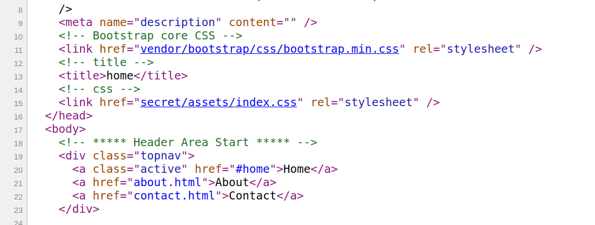
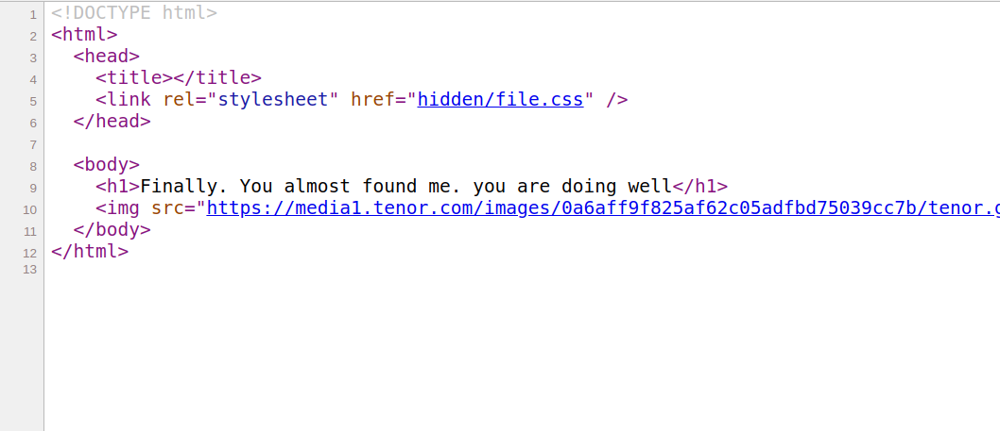
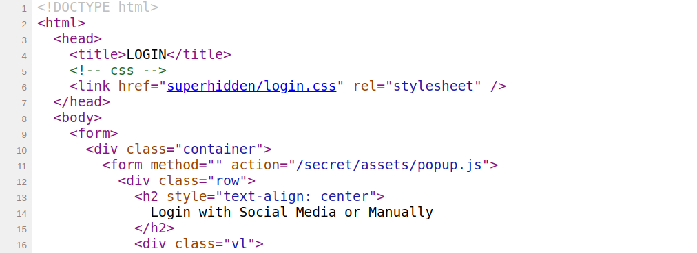
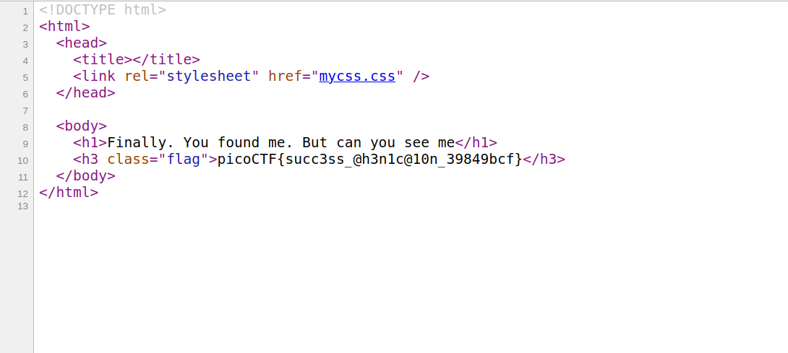

# WEB EXPLOITATION
i dont have rpoper knowledge of web development i am trying to learn the things for the first time the first time i encountered web exploitation was in wanna hack ctf. since that day i am trying to explore web exploitation most of the questions i have to go through walk throughs.
## Irish name repo
 
    it was pretty basic if you know sql injection.
when i opened website in the support section i found this important information


i observed two things 
one is about  Conan O'Brien
and other is  **sql error**
i entered admin login page and i tried some sql classic techniques
havving username **admin'--** 
and random passowrd and easy o got flag **picoCTF{s0m3_SQL_f8adf3fb}**

## Irish Name Repo2
 again the same question with some more difficulties

 that is they are cleverr this time and put up some filters the most common filter they though of might be commenting i.e,-- /* OR
 that what i though it is

 but when i tried word admin it showed its been filtered then again its classic example i used **ad'||'min;**
 tadow haha there comes the flag
 **picoCTF{m0R3_SQL_plz_aee925db}**

## Irish Name Repo3
in this challenge they have kept encryption for the password

so lets dive into  burpsuite

 we can see debug is off if we set debug value 1 then we can see the mechanism thats running and we can see the encrypted string for the password we enter

 after setting debug value 1 and using passowrd "hi"
 we get this on page
 ```
 password: hi
SQL query: SELECT * FROM admin where password = 'uv'
Login failed.
```
i entered password as hi but the encrypted password became 'uv'

i used the string "i am good at coding" as password

i got this
```
SQL query: SELECT * FROM admin where password = 'v nz tbbq ng pbqvat'
Login failed.
```
then i was confirmed the encryption is rot13
i used string **' vf abg'0** as password which is rot13 of **' is not '0**
and it worked it paid of
and flag is **picoCTF{3v3n_m0r3_SQL_7f5767f6}**


## Client side again
this problem was literally solved by chat gpt
when i opened up the for the source page i found something interesting
as given in hint section obfuscation of a solid code
i just copied it and pasted it in chatgpt snippet
and it came up with this thing
```
var _0x5a46 = ['37115}', '_again_3', 'this', 'Password Verified', 'Incorrect password', 'getElementById', 'value', 'substring', 'picoCTF{', 'not_this'];

(function(_0x4bd822, _0x2bd6f7) {
    var _0xb4bdb3 = function(_0x1d68f6) {
        while (--_0x1d68f6) {
            _0x4bd822['push'](_0x4bd822['shift']());
        }
    };
    _0xb4bdb3(++_0x2bd6f7);
}(_0x5a46, 0x1b3));

var _0x4b5b = function(_0x2d8f05, _0x4b81bb) {
    _0x2d8f05 = _0x2d8f05 - 0x0;
    var _0x4d74cb = _0x5a46[_0x2d8f05];
    return _0x4d74cb;
};

function verify() {
    checkpass = document[_0x4b5b('0x0')]('pass')[_0x4b5b('0x1')];  // document.getElementById('pass').value
    split = 4;
    
    if (checkpass[_0x4b5b('0x2')](0x0, split * 2) == _0x4b5b('0x3')) {  // checkpass.substring(0, 8) == 'picoCTF{'
    if (checkpass[_0x4b5b('0x2')](0x7, 0x9) == '{n') {  // checkpass.substring(7, 9) == '{n'
        if (checkpass[_0x4b5b('0x2')](split * 2, split * 2 * 2) == _0x4b5b('0x4')) {  // checkpass.substring(8, 16) == 'not_this'
                if (checkpass[_0x4b5b('0x2')](0x3, 0x6) == 'oCT') {  // checkpass.substring(3, 6) == 'oCT'
                    if (checkpass[_0x4b5b('0x2')](split * 3 * 2, split * 4 * 2) == _0x4b5b('0x5')) {  // checkpass.substring(24, 32) == '37115}'
                        if (checkpass['substring'](0x6, 0xb) == 'F{not') {  // checkpass.substring(6, 11) == 'F{not'
                            if (checkpass[_0x4b5b('0x2')](split * 2 * 2, split * 3 * 2) == _0x4b5b('0x6')) {  // checkpass.substring(16, 24) == '_again_3'
                                if (checkpass[_0x4b5b('0x2')](0xc, 0x10) == _0x4b5b('0x7')) {  // checkpass.substring(12, 16) == 'this'
                                    alert(_0x4b5b('0x8'));  // alert('Password Verified')
                                }
                            }
                        }
                    }
                }
            }
        }
    } else {
        alert(_0x4b5b('0x9'));  // alert('Incorrect password')
    }
}


````
by this i could clearly see chattt gpt commenting the flag out providing me with 4 differernt sections.

and got this as flag **picoCTF{not_this_again_37115}**

## WEB GAUTLET


in this challenge i am given with two pages one page shows login page and other shows the filters used so that i can bypass sql 

at first the filter was
```
Round1: or
```
and there seems to be 5 rounds
in first round the filter is OR

so used the username as  **admin'--**

yessss round 2 unlocked and with that filter page also got updated
```
Round2: or and like = --
```
i wasnt supposed to use -- so this time i came up with **admin'/***

round 3
```
Round3: or and = like > < --
```
again they didnt filter /* <br>
i used the same again got access to round 4

<br> in round4 the word admin is also filtered out
```
Round4: or and = like > < -- admin
```
i this time as in the challenge irish name repo 2 <br>
i used ad'||'min'; <br>
got access to round 5
but there wasnt any round 5 <br>
i got flag and the actual filter.php
anyways flag is **picoCTF{y0u_m4d3_1t_a3ed4355668e74af0ecbb7496c8dd7c5}**

## WEB GAUTLET 2
 in this challenge the filters are quite solid i cant use admin
 ```
 Filters: or and true false union like = > < ; -- /* */ admin
 ```
 i cant use the semicolon not comment also besically everything is filtered but every time we used only username section to bypas it seems we need to get aprove from password ssection <br>
 because everytime we either used to end the sentense at admin part only or else we used to comment out the password part
<br>
but this time its very new challenge so i want something true to appear in password section
```
SELECT username, password FROM users WHERE username='ad'||'min' AND password='pass'
```
so i tried doing some thing better 1' is '1 but didnt work i tried i tried this phrase
```
SELECT username, password FROM users WHERE username='ad'||'min' AND password='' is not '0'
```
 reason for this to work ' ' is not equal to string '0'
 so we get true in password section and it works
 ```
 <?php
session_start();

if (!isset($_SESSION["winner2"])) {
    $_SESSION["winner2"] = 0;
}
$win = $_SESSION["winner2"];
$view = ($_SERVER["PHP_SELF"] == "/filter.php");

if ($win === 0) {
    $filter = array("or", "and", "true", "false", "union", "like", "=", ">", "<", ";", "--", "/*", "*/", "admin");
    if ($view) {
        echo "Filters: ".implode(" ", $filter)."<br/>";
    }
} else if ($win === 1) {
    if ($view) {
        highlight_file("filter.php");
    }
    $_SESSION["winner2"] = 0;        // <- Don't refresh!
} else {
    $_SESSION["winner2"] = 0;
}

// picoCTF{0n3_m0r3_t1m3_e2db86ae880862ad471aa4c93343b2bf}
?>
```
the flag is **picoCTF{0n3_m0r3_t1m3_e2db86ae880862ad471aa4c93343b2bf}**

## WEB GAUTLET 3

in this challenge i was again supposed to work with the filters and sql technique to overcome the challenge

**to be honest i used the same techinwue i did for webgautlet 2 challenge**
```
Filters: or and true false union like = > < ; -- /* */ admin
```
```
SELECT username, password FROM users WHERE username='ad'||'min' AND password='pass'
```
so i tried doing some thing better 1' is '1 but didnt work i tried i tried this phrase
```
SELECT username, password FROM users WHERE username='ad'||'min' AND password='' is not '0'
```
 reason for this to work ' ' is not equal to string '0'
 so we get true in password section and it works
 ```
 <?php
session_start();

if (!isset($_SESSION["winner3"])) {
    $_SESSION["winner3"] = 0;
}
$win = $_SESSION["winner3"];
$view = ($_SERVER["PHP_SELF"] == "/filter.php");

if ($win === 0) {
    $filter = array("or", "and", "true", "false", "union", "like", "=", ">", "<", ";", "--", "/*", "*/", "admin");
    if ($view) {
        echo "Filters: ".implode(" ", $filter)."<br/>";
    }
} else if ($win === 1) {
    if ($view) {
        highlight_file("filter.php");
    }
    $_SESSION["winner3"] = 0;        // <- Don't refresh!
} else {
    $_SESSION["winner3"] = 0;
}

// picoCTF{k3ep_1t_sh0rt_6fdd78c92c7f26a10acd3ece176dea4d}
?>
```
and the flag is **picoCTF{k3ep_1t_sh0rt_6fdd78c92c7f26a10acd3ece176dea4d}**

## IntroToBuro

in this challenge we get chance to solve the otp bypassusing burp suite


Open BurpSuite and the proxy web browser with the link provided in the challenge description: http://titan.picoctf.net:49297/

For the first page, it doesn't matter the data you put in. You could put all values to anything and then click "Register". Now on the OTP page turn the "Intercept" function to on in BurpSuite.

Doesn't matter what is put for OTP. In the intercept now remove the text on line "otp=" but don't remove any spaces/lines just the text from the otp.

When forwarding this request the website gives the flag.

Flag: `picoCTF{#0TP_Bypvss_SuCc3$S_3e3d...}`

## Who are you?
The challenge gives us a link which opens a webpage saying "Only people who use the official PicoBrowser are allowed on this site!". Assuming that this means we have to change
our User-Agent in the request headers for the page, we can open up something like Postman (my personal favorite tool for modifying request headers) or Burpsuite. In Postman, we create
a new request, set the request type to GET, and pass our given link as the URL. Clicking "Send" will show us the very same page in the "Preview" tab under the Body of the result of
the request. In the "Headers" portion of our request we can change the request headers where we set a new one called User-Agent and its value to PicoBrowser.

After clicking send we see a new message of "I don't trust users visiting from another site.". Seeing as this whole challenge will most likely be a string of HTTP Request Header
modifications we can head to the bible of HTTP request headers at https://developer.mozilla.org/en-US/docs/Web/HTTP/Headers/Referer and do some digging around. We find the "Referer"
header which should do this perfectly for us and set its value to the page url (http://mercury.picoctf.net:39114/ for me). 

Now we get a message saying "Sorry, this site only worked in 2018". We create add another HTTP request header called Date and set its value to 2018 to bypass this check. Next the 
site tells us that "I don't trust users who can be tracked.". There is an HTTP header called "DNT" which if set to true will send a Do-Not-Track request to the site. We add this to
our list of headers as "DNT" with a value of 1 for true.

Next up the website contents is changed to "This website is only for people from Swedenn.". We find another header called "X-Forwarded-For" which can change the originating ip of
a request. For this, I googled Swedish IP addresses and used the first one I found. The final header is called "X-Forwarded-For" and has a value of "2.16.66.0". Finally, the website
changes its contents to "You're in Sweden but you don't speak Swedish?". To bypass this we can use the "Accept-Language" header with a value of "sv" which is the language code for Swedish.

Sending this final request gets us the flag. All in all this challenge required some research about HTTP Request Headers and looking through HTTP headers docs on developer.mozilla.org. If you don't understand what any of these request headers do you can go to that page I linked earlier and find a very detailed description with examples about each.

The final request in Postman looked as such:


Alternatively the challenge could have been solved using the curl command with the -H tag to add headers to the request as such:
```
zerodaytea@DESKTOP-QLQGDSV:/mnt/c/Coding/CTFs$ curl 'http://mercury.picoctf.net:39114/'   -H 'Connection: keep-alive'   -H 'Cache-Control: max-age=0'   -H 'DNT: 1'   -H 'Upgrade-Insecure-Requests: 1'   -H 'User-Agent: Mozilla/5.0 (Windows NT 10.0; Win64; x64) AppleWebKit/537.36 (KHTML, like Gecko) Chrome/90.0.4430.212 Safari/537.36'   -H 'Accept: text/html,application/xhtml+xml,application/xml;q=0.9,image/avif,image/webp,image/apng,*/*;q=0.8,application/signed-exchange;v=b3;q=0.9'   -H 'Accept-Language: en-US,en;q=0.9,pl-PL;q=0.8,pl;q=0.7'   --compressed   --insecure -H 'User-Agent: PicoBrowser' -H 'Referer: http://mercury.picoctf.net:39114/' -H 'Date: 2018' -H 'X-Forwarded-For: 2.16.66.0' -H 'Accept-Lan
guage: sv'
<!DOCTYPE html>
<html lang="en">

<head>
    <title>Who are you?</title>


# Who are you?


The challenge gives us a link which opens a webpage saying "Only people who use the official PicoBrowser are allowed on this site!". Assuming that this means we have to change
our User-Agent in the request headers for the page, we can open up something like Postman (my personal favorite tool for modifying request headers) or Burpsuite. In Postman, we create
a new request, set the request type to GET, and pass our given link as the URL. Clicking "Send" will show us the very same page in the "Preview" tab under the Body of the result of
the request. In the "Headers" portion of our request we can change the request headers where we set a new one called User-Agent and its value to PicoBrowser.

After clicking send we see a new message of "I don't trust users visiting from another site.". Seeing as this whole challenge will most likely be a string of HTTP Request Header
modifications we can head to the bible of HTTP request headers at https://developer.mozilla.org/en-US/docs/Web/HTTP/Headers/Referer and do some digging around. We find the "Referer"
header which should do this perfectly for us and set its value to the page url (http://mercury.picoctf.net:39114/ for me). 

Now we get a message saying "Sorry, this site only worked in 2018". We create add another HTTP request header called Date and set its value to 2018 to bypass this check. Next the 
site tells us that "I don't trust users who can be tracked.". There is an HTTP header called "DNT" which if set to true will send a Do-Not-Track request to the site. We add this to
our list of headers as "DNT" with a value of 1 for true.

Next up the website contents is changed to "This website is only for people from Swedenn.". We find another header called "X-Forwarded-For" which can change the originating ip of
a request. For this, I googled Swedish IP addresses and used the first one I found. The final header is called "X-Forwarded-For" and has a value of "2.16.66.0". Finally, the website
changes its contents to "You're in Sweden but you don't speak Swedish?". To bypass this we can use the "Accept-Language" header with a value of "sv" which is the language code for Swedish.

Sending this final request gets us the flag. All in all this challenge required some research about HTTP Request Headers and looking through HTTP headers docs on developer.mozilla.org. If you don't understand what any of these request headers do you can go to that page I linked earlier and find a very detailed description with examples about each.


Alternatively the challenge could have been solved using the curl command with the -H tag to add headers to the request as such:
```
zrevan@revan-Victus-by-HP-Gaming-Laptop-15-fa0xxx:$ curl 'http://mercury.picoctf.net:39114/'   -H 'Connection: keep-alive'   -H 'Cache-Control: max-age=0'   -H 'DNT: 1'   -H 'Upgrade-Insecure-Requests: 1'   -H 'User-Agent: Mozilla/5.0 (Windows NT 10.0; Win64; x64) AppleWebKit/537.36 (KHTML, like Gecko) Chrome/90.0.4430.212 Safari/537.36'   -H 'Accept: text/html,application/xhtml+xml,application/xml;q=0.9,image/avif,image/webp,image/apng,*/*;q=0.8,application/signed-exchange;v=b3;q=0.9'   -H 'Accept-Language: en-US,en;q=0.9,pl-PL;q=0.8,pl;q=0.7'   --compressed   --insecure -H 'User-Agent: PicoBrowser' -H 'Referer: http://mercury.picoctf.net:39114/' -H 'Date: 2018' -H 'X-Forwarded-For: 2.16.66.0' -H 'Accept-Lan
guage: sv'
<!DOCTYPE html>
<html lang="en">

<head>
    <title>Who are you?</title>


    <link href="https://maxcdn.bootstrapcdn.com/bootstrap/3.2.0/css/bootstrap.min.css" rel="stylesheet">

    <link href="https://getbootstrap.com/docs/3.3/examples/jumbotron-narrow/jumbotron-narrow.css" rel="stylesheet">

    <script src="https://ajax.googleapis.com/ajax/libs/jquery/3.3.1/jquery.min.js"></script>

    <script src="https://maxcdn.bootstrapcdn.com/bootstrap/3.3.7/js/bootstrap.min.js"></script>


</head>

<body>

    <div class="container">
      <div class="jumbotron">
        <p class="lead"></p>
                <div class="row">
                        <div class="col-xs-12 col-sm-12 col-md-12">
                                <h3 style="color:green">What can I say except, you are welcome</h3>
                        </div>
                </div>
                <br/>

                        <b>picoCTF{http_h34d3rs_v3ry_c0Ol_much_w0w_20ace0e4}</b>

        </div>
    <footer class="footer">
        <p>&copy; PicoCTF</p>
    </footer>

</div>
<script>
$(document).ready(function(){
    $(".close").click(function(){
        $("myAlert").alert("close");
    });
});
</script>
</body>

</html>
```

```
picoCTF{http_h34d3rs_v3ry_c0Ol_much_w0w_20ace0e4}
```

## JaWT Scratchpad
When we enter this link, we are greeted with a scratchpad web app of some type. It lets us through for any user besides "admin". When it does let us through, we see a cookie pop up in the Application tab of Chrome Developer tools called "jwt". This stores a long sequence of characters. If we search up "jwt", we find out that it is a JSON Web Token that is comprised of three components: the header, the payload, and the signature. If we decode the jwt cookie that we got at [jwt.io](https://jwt.io/), we see from the header that this is a jwt that uses the HS256 algorithm. The payload is just one value: our username. We know that the correct username is "admin", as that is who the website does not let log in, but we don't know the signature. From here, we need to use JohnTheRipper, which is linked on the JaWT Scratchpad site under the name input. JohnTheRipper uses a brute force method to figure out the signature of jwt. However, it is very slow, as it has to go through so many possibilities. A better way is to use a word list. What a word list is is a dictionary of common secrets for JohnTheRipper to narrow down the possibilities and crack the signature faster. This could mean the difference between several hours and mere few seconds. A very strong word list is [rockyou](https://github.com/brannondorsey/naive-hashcat/releases/download/data/rockyou.txt), which has a massive collection of common words. After running this, JohnTheRipper gets you the secret: `ilovepico`. You can go back to jwt.io and put it in along with the user in the payload being 'admin'. Insert this as your jwt cookie and login to bypass the portal and obtain the flag.


`picoCTF{jawt_was_just_what_you_thought_6ba7694bcc36bdd4fdaf010b2ec1c2c3}`

## Secrets
its very good challenge first in the website we get when we inspect 
 The hint mentioned as `folders` again and again. So, I manually looking forward for folders were refered to `href` through viewing the source code.

An index page refers to `/secret/` path.



A secret path refers to `/hidden/` path.



A hidden path refers to `/superhidden/` path.



Here's the flag.




```
picoCTF{succ3ss_@h3n1c@10n_39849bcf}
```

## JAVA SCRIPT KIDDIE


The source of the attached website is as follows:

```html
<html>
	<head>    
		<script src="jquery-3.3.1.min.js"></script>
		<script>
			var bytes = [];
			$.get("bytes", function(resp) {
				bytes = Array.from(resp.split(" "), x => Number(x));
			});

			function assemble_png(u_in){
				var LEN = 16;
				var key = "0000000000000000";
				var shifter;
				if(u_in.length == LEN){
					key = u_in;
				}
				var result = [];
				for(var i = 0; i < LEN; i++){
					shifter = key.charCodeAt(i) - 48;
					for(var j = 0; j < (bytes.length / LEN); j ++){
						result[(j * LEN) + i] = bytes[(((j + shifter) * LEN) % bytes.length) + i]
					}
				}
				while(result[result.length-1] == 0){
					result = result.slice(0,result.length-1);
				}
				document.getElementById("Area").src = "data:image/png;base64," + btoa(String.fromCharCode.apply(null, new Uint8Array(result)));
				return false;
			}
		</script>
	</head>
	<body>

		<center>
			<form action="#" onsubmit="assemble_png(document.getElementById('user_in').value)">
				<input type="text" id="user_in">
				<input type="submit" value="Submit">
			</form>
			
		</center>

	</body>
</html>
```

If we enter a random value in the form, we receive a broken image. It looks like the javascript code first makes a request to receive a list of bytes:
```
137 147 206 121 126 59 121 231 0 4 121 188 174 107 242 107 0 124 231 234 119 50 0 0 1 147 229 170 73 153 65 191 164 121 48 249 53 254 26 10 84 199 169 75 0 28 1 53 48 82 78 249 171 61 1 114 224 133 203 169 155 66 255 130 145 80 1 183 76 131 68 65 89 229 134 32 113 72 148 82 12 0 0 184 2 218 186 76 169 250 151 249 194 192 96 108 170 0 134 157 119 75 131 120 112 231 157 255 131 65 68 235 231 12 6 192 0 222 228 69 249 69 255 1 157 110 95 204 59 230 195 71 13 0 183 112 6 0 78 68 32 78 138 41 76 175 239 114 0 10 107 243 179 0 0 13 25 144 54 75 141 137 226 2 135 0 74 146 212 120 0 0 49 119 154 121 231 191 113 63 61 73 207 252 109 29 156 237 237 205 44 181 255 234 45 201 81 7 111 130 76 72 160 71 252 189 222 4 45 102 16 164 153 122 6 236 97 221 248 223 189 159 191 15 186 67 214 172 254 6 103 1 239 222 111 241 128 173 157 249 176 240 95 173 172 207 128 248 254 100 121 231 32 123 102 156 187 25 219 126 99 10 127 136 254 208 144 42 223 245 199 191 126 63 242 65 146 62 217 103 195 245 123 51 216 107 122 239 128 4 205 81 87 164 77 166 255 1 56 191 144 200 56 6 36 54 208 38 51 163 146 136 97 152 102 86 67 136 54 254 211 246 158 221 31 179 191 243 21 0 230 168 247 251 222 113 110 91 32 183 22 244 45 1 220 168 97 180 247 205 207 14 199 186 146 106 250 144 115 222 151 173 111 131 220 144 233 122 255 219 176 73 150 157 22 143 74 217 68 101 232 176 170 113 254 92 169 250 106 153 148 251 31 124 122 156 191 239 186 121 94 197 5 252 248 34 55 29 252 124 181 226 55 127 124 206 48 75 126 234 94 137 135 121 191 89 24 135 209 221 81 56 181 115 52 122 68 77 240 90 247 182 197 190 111 203 15 236 79 123 223 170 144 93 244 56 247 7 190 219 76 219 245 39 129 110 133 226 176 46 193 253 78 206 160 247 86 91 37 36 24 234 87 241 98 57 36 107 14 56 242 135 213 233 55 229 121 228 96 149 95 6 92 30 230 184 44 149 107 102 16 42 182 95 228 158 18 21 32 205 77 53 94 221 173 252 21 127 15 82 95 163 242 120 224 214 163 0 230 91 72 244 111 255 32 95 225 170 135 57 178 172 87 45 193 84 78 90 202 51 178 127 63 249 165 189 47 239 27 208 191 248 67 223 59 130 249 207 207 49 252 164 114 231 181 214 188 181 227 26 125 27 198 147 64 200 215 229 143 249 29 171 227 252 115 152 80 6 143 53 160 77 210 113 143 214 204 219 20 236 102 252 153 126 12 3 249 152 188 213 49 94 226 157 55 144 180 159 251 199 200 141 203 31 146 9 206 111 7 85 183 119 73 111 109 171 243 240 189 215 29 215 242 235 162 178 174 106 73 165 173 84 219 232 242 250 59 147 235 27 119 211 11 99 98 142 102 37 139 64 58 30 49 178 226 245 73 253 239 252 179 115 177 18
```

It then performs swaps based on the key entered by the user. If the key is correct, the swaps will turn this byte array into a valid PNG image.

The key is 16 characters long, and judging according to the `key.charCodeAt(i) - 48` snippet, valid characters are only digits (since this is a well-known method to turn a digit's ASCII value to the actual digit it represents).

A [PNG file](http://www.libpng.org/pub/png/spec/1.2/PNG-Structure.html) starts with a magic signature of eight bytes (`89 50 4E 47 0D 0A 1A 0A`) followed by a series of chunks, where  each chunk header has a well-known structure: 4 bytes of length and 4 bytes of chunk type. The first chunk is called `IHDR` and has the length of 0XD, so we know that the next 8 bytes are `00 00 00 0D 49 48 44 52`.

```console
revan@revan-Victus-by-HP-Gaming-Laptop-15-fa0xxx:~/Desktop/CyberSec/csocweek3/pics$ xxd -g 1 ../Flags/flag.png | head
00000000: 89 50 4e 47 0d 0a 1a 0a 00 00 00 0d 49 48 44 52  .PNG........IHDR
00000010: 00 00 06 6a 00 00 04 47 08 02 00 00 00 7c 8b ab  ...j...G.....|..
00000020: 78 00 00 00 01 73 52 47 42 00 ae ce 1c e9 00 00  x....sRGB.......
00000030: 00 04 67 41 4d 41 00 00 b1 8f 0b fc 61 05 00 00  ..gAMA......a...
00000040: 00 09 70 48 59 73 00 00 16 25 00 00 16 25 01 49  ..pHYs...%...%.I
00000050: 52 24 f0 00 00 a8 8e 49 44 41 54 78 5e ec dd 2d  R$.....IDATx^..-
00000060: 94 dc 46 da 30 ec 07 18 0e 34 0c 34 0c 0c da b3  ..F.0....4.4....
00000070: 30 30 70 e1 c2 3d 8b 0c 0d 0d 0d 03 16 18 06 06  00p..=..........
00000080: 06 e6 3c c8 e0 01 86 86 66 6b 18 68 e8 f3 a2 9c  ..<.....fk.h....
00000090: f3 7d 25 d5 8f ee 2a a9 66 ba 67 ba c7 3f b9 ae  .}%...*.f.g..?..
```

Since we know how the first 16 bytes of a PNG file should look like, we can guess the key.

For each character of the key, we just need to try all digits until we find one that places the expected value in the current location. 

Note that depending on our input, we might end up with several keys that correctly recreate the first 16 bytes of the PNG file. We should ignore any solution which doesn't produce a valid PNG file though.

Here's a script that does this:
```python
from PIL import Image
import itertools, io, os
KEY_LEN = 16

def create_png(bytes_arr, key, out_dir_path):
    if not os.path.isdir(out_dir_path):
        raise Exception("Output folder ('{}') does not exist!".format(out_dir_path))
    result = [0] * len(bytes_arr)
    for i in range(KEY_LEN):
        shifter = int(key[i])
        for j in range(len(bytes_arr) // KEY_LEN):
            result[(j * KEY_LEN) + i] = bytes_arr[(((j + shifter) * KEY_LEN) % len(bytes_arr)) + i]
    img_bytes = io.BytesIO(bytes(result))

    try:
        img = Image.open(img_bytes)
        img.save(os.path.join(out_dir_path, "{}.png".format(key)))
        print ("Key {} produces a valid PNG - Saving".format(key))
    except IOError:
        print ("Key {} produces an invalid PNG - Ignoring".format(key))


shifters = []
for i in range(KEY_LEN):
    shifters.append([])
expected = [0x89, 0x50, 0x4E, 0x47, 0x0D, 0x0A, 0x1A, 0x0A, 0x00, 0x00, 0x00, 0x0D, 0x49, 0x48, 0x44, 0x52]
with open("bytes.txt") as f:
    bytes_arr = list(map(int, f.read().split(" ")))
    for i in range(KEY_LEN):
        for shifter in range(10):
            j = 0
            offset = (((j + shifter) * KEY_LEN) % len(bytes_arr)) + i
            if bytes_arr[offset] == expected[i]:
                shifters[i].append(shifter)               

for p in itertools.product(*shifters):
    key = "".join("{}".format(n) for n in p)
    create_png(bytes_arr, key, "out")
```

Running the script produces the following key:
```console
revan@revan-Victus-by-HP-Gaming-Laptop-15-fa0xxx:~/Desktop/CyberSec/csocweek3/pics$python3 solve.py
[[0], [4], [3], [8], [8], [9], [2], [2], [0], [8, 9], [9], [9], [1], [4], [6], [4]]
Key 0438892208991464 produces a valid PNG - Saving
Key 0438892209991464 produces an invalid PNG - Ignoring
```

Using the valid key, we get the following image:


Which translates to the flag:

```console
revan@revan-Victus-by-HP-Gaming-Laptop-15-fa0xxx:~/Desktop/CyberSec/csocweek3/pics$ zbarimg out/0438892208991464.png
QR-Code:picoCTF{905765bf9ae368ad98261c10914d894e}
scanned 1 barcode symbols from 1 images in 0.11 seconds
```
and flag is **picoCTF{905765bf9ae368ad98261c10914d894e}**

# Java Script Kiddie 2


This problem is very similar to Java Script Kiddie,  Just like the previous one, we have a textbox and a submit button. The javascript is slightly different:

```js
var bytes = [];
$.get("bytes", function(resp) {
	bytes = Array.from(resp.split(" "), x => Number(x));
});

function assemble_png(u_in){
	var LEN = 16;
	var key = "00000000000000000000000000000000";
	var shifter;
	if(u_in.length == key.length){
		key = u_in;
	}
	var result = [];
	for(var i = 0; i < LEN; i++){
		shifter = Number(key.slice((i*2),(i*2)+1));
		for(var j = 0; j < (bytes.length / LEN); j ++){
			result[(j * LEN) + i] = bytes[(((j + shifter) * LEN) % bytes.length) + i]
		}
	}
	while(result[result.length-1] == 0){
		result = result.slice(0,result.length-1);
	}
	document.getElementById("Area").src = "data:image/png;base64," + btoa(String.fromCharCode.apply(null, new Uint8Array(result)));
	return false;
}
```
The AJAX query for [`bytes`](bytes.txt) is identical, although the data is obviously different. The rest of the program is nearly the same in that `bytes` is used as a 2D array with 16 columns. However, we notice the key is twice as long: the key now takes two digits for each column to determine how much to shift. We can write a similar python script for visualization purposes:

```python
def tohex(a):
	return "{:02x}".format(a)

f = open("bytes.txt", "r")
bytelist = map(int, f.read().split(" "))
f.close()

key = "00000000000000000000000000000000"
result = [0 for x in bytelist]
SIZE = 16
for i in range(SIZE):
	shift = int(key[i*2:(i+1)*2])
	for j in range(len(result) / SIZE):
		result[(j*SIZE + i)] = bytelist[(((j+shift)*SIZE) % len(bytelist)) + i]

for i in range(len(result) / SIZE):
	print ' '.join(map(tohex, result[i*SIZE:(i+1)*SIZE]))
```
Just as in the previous problem, we must have the first row look like this:
```
89 50 4e 47 0d 0a 1a 0a 00 00 00 0d 49 48 44 52
```
Additionally, we can use the constraints of the second row as in the previous problem. Thus, we determine the key will be of the form `010600050109030600AABB0101050600` where `AA = 06,07` and `BB = 04,05`. By testing each of the four options, we find that the key is `01060005010903060007050101050600`, which gives us the following QR code:


The QR [decodes](https://zxing.org/w/decode.jspx) to the flag:

> `picoCTF{9064bc1bb5f8b7bd526686a311bfc18c}`